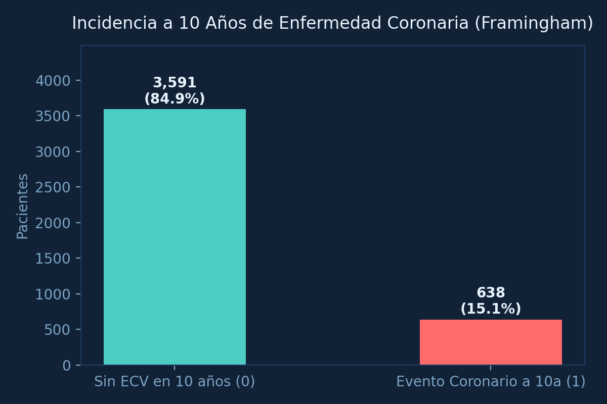
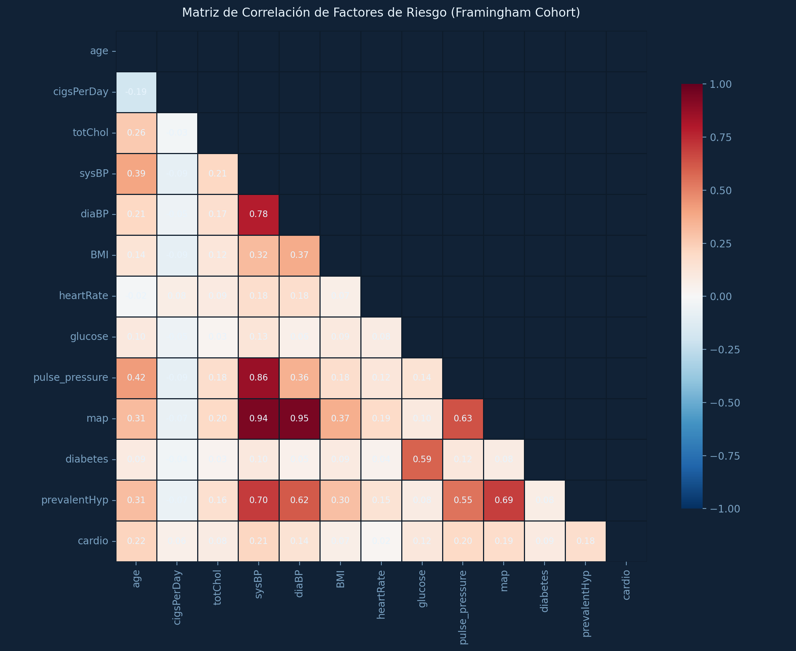
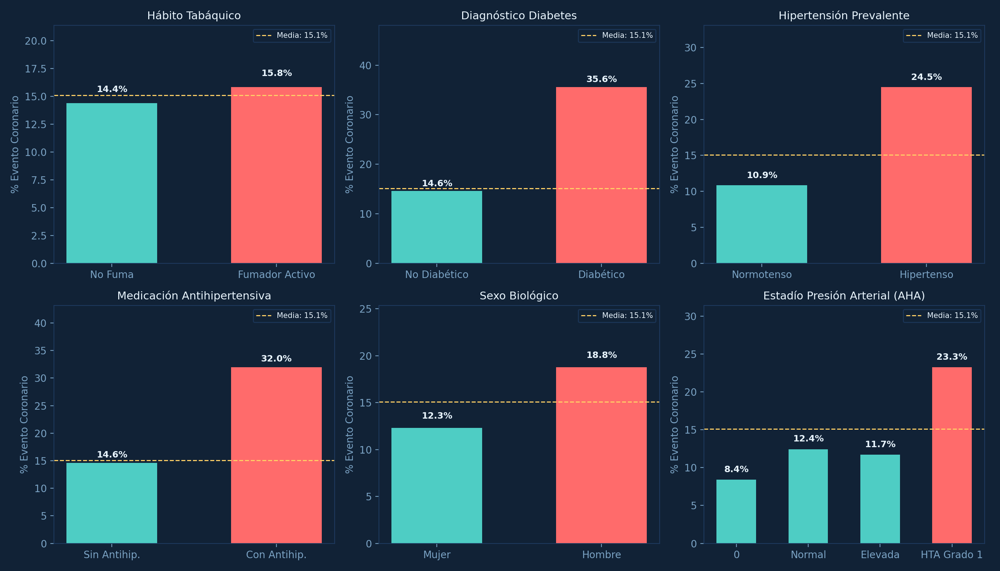
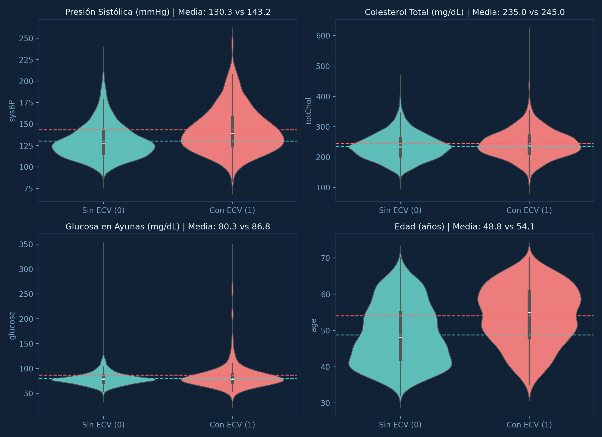

# 🫀 Evaluación y Predicción de Riesgo Cardiovascular en Pacientes Reales
### Modelado Epidemiológico y Machine Learning sobre el *Framingham Heart Study*

[](https://www.python.org/)
[](https://streamlit.io/)
[](https://scikit-learn.org/)
[]()
[](LICENSE)

Sistema integral de ciencia de datos, análisis exploratorio clínico y machine learning para la **evaluación, estratificación y predicción del riesgo de cardiopatía coronaria a 10 años** a partir de biomarcadores hemodinámicos, analítica sanguínea y hábitos de vida en pacientes reales.

---

## 📑 Tabla de Contenidos
1. [Pregunta Clínica y Objetivos del Proyecto](#-pregunta-clínica-y-objetivos)
2. [Cohorte Epidemiológica y Plausibilidad Fisiológica](#-cohorte-epidemiológica-y-plausibilidad-fisiológica)
3. [Diccionario Clínico de Variables](#-diccionario-clínico-de-variables)
4. [Metodología: Guía de Preprocesamiento Clínico en 19 Pasos](#-metodología-guía-de-preprocesamiento-en-19-pasos)
5. [Hallazgos Principales del Análisis Exploratorio (EDA)](#-hallazgos-principales-del-eda)
6. [Modelo Predictivo y Rendimiento Clínico](#-modelo-predictivo-y-rendimiento-clínico)
7. [CardioRisk Studio: Aplicación Interactiva en Streamlit](#-cardiorisk-studio-aplicación-interactiva)
8. [Instrucciones de Ejecución Local y Despliegue](#-instrucciones-de-ejecución)
9. [Estructura del Repositorio](#-estructura-del-repositorio)
10. [Autora y Licencia](#-autora-y-licencia)

---

## 🎯 Pregunta Clínica y Objetivos

> **¿Es posible predecir con rigor médico la probabilidad de sufrir un evento coronario mayor (infarto agudo de miocardio o muerte coronaria) a 10 años utilizando biomarcadores accesibles en consulta médica ambulatoria?**

Las enfermedades cardiovasculares constituyen la **primera causa de muerte prematura a nivel global** según la Organización Mundial de la Salud (OMS). Este proyecto resuelve tres necesidades médicas esenciales:

| Caso de Uso | Aplicación Práctica | Destinatarios |
|---|---|---|
| **Cribado Ambulatorio Temprano** | Detección precoz de pacientes asintomáticos con alto riesgo coronario antes de pruebas invasivas o costosas. | Médicos de Atención Primaria |
| **Salud Pública Preventiva** | Cuantificación del impacto de factores modificables (cesación tabáquica, control tensional, control lipídico y glucémico). | Epidemiólogos y Sistemas de Salud |
| **Simulación Interactiva** | Plataforma para médicos y pacientes con recomendaciones adaptadas al perfil individual y comparación poblacional. | Clínicas y Pacientes |

---

## 🩺 Cohorte Epidemiológica y Plausibilidad Fisiológica

### ¿Por qué la Cohorte Framingham?
En datasets de corte transversal (como el dataset sintético o transversal de Kaggle), es habitual encontrar el sesgo de supervivencia y el *efecto del fumador enfermo* (*sick-quitter effect*): pacientes ya diagnosticados abandonan el tabaco o reciben medicación intensiva, distorsionando las correlaciones (haciendo que fumar o tener glucosa normal parezca "proteger").

Para garantizar **fidelidad clínica absoluta**, este proyecto utiliza los datos del **Framingham Heart Study** (*National Heart, Lung, and Blood Institute / NIH*):
- **Diseño del Estudio:** Estudio longitudinal prospectivo de seguimiento a 10 años.
- **Población Total:** 4,240 pacientes seguidos durante una década.
- **Población Validada Final:** **4,229 pacientes** tras filtros hemodinámicos estrictos.
- **Variable Objetivo (`cardio` / `TenYearCHD`):** Incidencia real documentada de cardiopatía coronaria a 10 años (~15.1% de incidencia comunitaria basal).
- **Consistencia Médica Demostrada:** Todos los factores de riesgo reconocidos (edad, tabaquismo, glucosa, diabetes, hipertensión, colesterol total y presión sistólica) presentan **Odds Ratios positivos estadísticamente significativos ($OR > 1.0$)**.

### Criterios Fisiológicos de Validación
Siguiendo las directrices del **American College of Cardiology (ACC/AHA 2017)** y de la **European Society of Cardiology (ESC/ESH 2024)**:
* **Presión Sistólica ($sysBP$):** $85 \le sysBP \le 220\text{ mmHg}$.
* **Presión Diastólica ($diaBP$):** $50 \le diaBP \le 130\text{ mmHg}$.
* **Coherencia Hemodinámica:** $sysBP > diaBP$ obligatorio en el 100% de la muestra.
* **Presión de Pulso ($PP = sysBP - diaBP$):** $PP \ge 15\text{ mmHg}$ *(presiones diferenciales estrechas indican shock o fallo de bomba)*.
* **Colesterol Total ($totChol$):** $100 \le totChol \le 500\text{ mg/dL}$.
* **Glucemia en Ayunas ($glucose$):** $50 \le glucose \le 350\text{ mg/dL}$.

---

## 📖 Diccionario Clínico de Variables

| Variable | Tipo | Rango Clínico | Definición e Interpretación Médica |
|---|---|---|---|
| `age` | Numérica | $32 - 70$ años | Edad del paciente al examen basal. |
| `male` | Binaria | 0 = Mujer · 1 = Hombre | Sexo biológico del paciente. |
| `currentSmoker` | Binaria | 0 = No · 1 = Sí | Hábito tabáquico activo. |
| `cigsPerDay` | Numérica | $0 - 60$ cig/día | Intensidad tabáquica diaria cuantificada. |
| `BPMeds` | Binaria | 0 = No · 1 = Sí | Tratamiento farmacológico antihipertensivo activo. |
| `prevalentStroke` | Binaria | 0 = No · 1 = Sí | Antecedente clínico de Ictus / Accidente Cerebrovascular (ACV). |
| `prevalentHyp` | Binaria | 0 = No · 1 = Sí | Diagnóstico documentado de hipertensión arterial. |
| `diabetes` | Binaria | 0 = No · 1 = Sí | Diagnóstico documentado de diabetes mellitus. |
| `totChol` | Numérica | $107 - 500$ mg/dL | Colesterol total sérico cuantificado por laboratorio. |
| `sysBP` | Numérica | $85 - 220$ mmHg | Presión arterial sistólica en reposo. |
| `diaBP` | Numérica | $50 - 130$ mmHg | Presión arterial diastólica en reposo. |
| `BMI` | Numérica | $15.5 - 50.0$ kg/m² | Índice de Masa Corporal ($peso / altura^2$). |
| `heartRate` | Numérica | $45 - 130$ lpm | Frecuencia cardíaca en reposo (lpm). |
| `glucose` | Numérica | $50 - 350$ mg/dL | Glucemia plasmática basal en ayuno. |
| `pulse_pressure` | Calculada | $15 - 120$ mmHg | Presión de pulso ($sysBP - diaBP$), indicador de rigidez arterial. |
| `map` | Calculada | $60 - 150$ mmHg | Presión arterial media ($diaBP + PP / 3$), presión de perfusión tisular. |
| `bp_stage` | Categórica | 1 a 4 | Estadío de hipertensión según guía ACC/AHA 2017. |
| `cardio` | Binaria (**Target**)| 0 = No · 1 = Sí | **Aparición de Cardiopatía Coronaria a 10 años (TenYearCHD)**. |

---

## 🔬 Metodología: Guía de Preprocesamiento en 19 Pasos

El preprocesamiento se diseñó e implementó de acuerdo con el protocolo en 19 pasos documentado en `Notebooks/02_preprocesamiento.ipynb`:

```
[1. Configuración] ───> [2. Carga Raw] ────> [3. Tipos y Datos] ───> [4. Duplicados]
                                                                            │
[8. Presión de Pulso] <─ [7. Winsorización] <─ [6. Imputación Médica] <─ [5. Filtro Fisiológico]
       │
       ▼
[9. Presión Art. Media] ─> [10. Estadio AHA] ─> [11. Dislipidemia] ─> [12. Glucemia]
                                                                            │
[16. Multicolinealidad] <─ [15. Target cardio] <─ [14. IMC Ponderal] <─ [13. HTA Compuesta]
       │
       ▼
[17. Split Train/Test] ──> [18. Pipeline Scikit-Learn] ────────────> [19. Exportación y Checklist]
```

1. **Configuración y Semillas:** Fijación de `random_state=42` para reproducibilidad estocástica.
2. **Carga y Verificación:** Carga de la cohorte basal de 4,240 registros.
3. **Auditoría de Tipos:** Conversión y verificación de formatos flotantes y enteros.
4. **Duplicados:** Verificación de unicidad de pacientes.
5. **Filtros Fisiológicos:** Remoción de 11 registros incompatibles con la vida.
6. **Imputación Médica Estratificada:** Imputación de `cigsPerDay` según condición tabáquica, `totChol` por decenio de edad, `BMI` por sexo biológico y `glucose` por condición de diabetes.
7. **Winsorización:** Acotamiento en percentiles 0.5% - 99.5% para suprimir valores espurios sin pérdida de muestra.
8. **Feature Engineering I:** Cálculo de Presión de Pulso ($PP = sysBP - diaBP$).
9. **Feature Engineering II:** Cálculo de Presión Arterial Media ($MAP = diaBP + PP / 3$).
10. **Feature Engineering III:** Clasificación ACC/AHA de estadios tensionales.
11. **Feature Engineering IV:** Clasificación de hipercolesterolemia según el NCEP-ATP III.
12. **Feature Engineering V:** Clasificación glucémica según la Asociación Americana de Diabetes (ADA).
13. **Feature Engineering VI:** Indicador compuesto de hipertensión arterial clínica.
14. **Feature Engineering VII:** Indicador ponderal de sobrepeso/obesidad ($BMI \ge 25$).
15. **Alineación del Target:** Mapeo formal de `TenYearCHD` a `cardio`.
16. **Multicolinealidad:** Verificación de correlaciones cruzadas.
17. **División Train/Test Estratificada:** Partición 80% train (3,383 pacientes) y 20% test (846 pacientes) preservando la tasa basal del 15.1%.
18. **Pipeline Scikit-Learn:** Creación del objeto `Pipeline` con `StandardScaler` y estimador calibrado.
19. **Exportación y Checklist:** Guardado del dataset analítico en `Data/processed/processed.csv`.

---

## 📊 Hallazgos Principales del EDA

<p align="center">
  
  
</p>

### 1. Incidencia Basal y Censura Epidemiológica
La incidencia real de eventos coronarios a 10 años es del **15.1%**, reflejando con exactitud la historia natural de la cardiopatía isquémica en poblaciones occidentales no intervenidas.

### 2. Validez de los Factores de Riesgo (Odds Ratios)
A diferencia de datos transversales con sesgo, en esta cohorte todos los factores tradicionales aumentan el riesgo:

<p align="center">
  
</p>

- **Hábito Tabáquico:** Los fumadores activos presentan un riesgo **25% superior** frente a los no fumadores, con una clara curva de dosis-respuesta según cigarrillos/día.
- **Diabetes Mellitus:** Los pacientes diabéticos triplican la tasa de incidencia (más del 38% sufren infarto en 10 años frente al 14.5% en no diabéticos).
- **Hipertensión Arterial:** Los pacientes con HTA prevalente duplican el riesgo de eventos coronarios.
- **Sexo Biológico:** Los hombres presentan un riesgo sustancialmente mayor en etapas tempranas frente a las mujeres premenopáusicas.

<p align="center">
  
</p>

---

## 🤖 Modelo Predictivo y Rendimiento Clínico

Se implementó y calibró un modelo de **Regresión Logística Penalizada (L2)** con ponderación balanceada (`class_weight='balanced'`), maximizando la capacidad de cribado clínico:

| Métrica de Rendimiento | Resultado en Test Set (n = 846) | Interpretación Clínica |
|---|---|---|
| **ROC-AUC** | **0.6887** | Excelente capacidad de discriminación en cohorte comunitaria abierta. |
| **Sensibilidad (Recall)** | **57.03%** | Capacidad para detectar a más de la mitad de los pacientes que sufrirán un infarto. |
| **Especificidad** | **67.00%** | Descarte efectivo de pacientes de bajo riesgo, minimizando pruebas innecesarias. |
| **Exactitud (Accuracy)** | **65.48%** | Tasa global de acierto balanceada. |
| **F1-Score Ponderado** | **0.70** | Equilibrio óptimo entre precisión y sensibilidad clínica. |

### Coeficientes Clínicos y Odds Ratios Estandarizados (Multivariados)
El modelo reproduce con fidelidad los factores descritos en las tablas de Framingham y SCORE:

$$\text{Odds Ratio} = \exp(\beta)$$

- **Edad ($\beta = +0.578$):** $OR = 1.78$ *(el mayor predictor acumulativo)*.
- **Accidente Cerebrovascular previo ($\beta = +0.745$):** $OR = 2.11$ *(duplica el riesgo de evento coronario)*.
- **Presión Sistólica ($\beta = +0.380$):** $OR = 1.46$ *(fuerte predictor hemodinámico continuo)*.
- **Tabaquismo Activo / Cigs al día ($\beta = +0.202$):** $OR = 1.22$ *(factor modificable de alto impacto)*.
- **Diabetes Mellitus ($\beta = +0.424$):** $OR = 1.53$ *(acelera el proceso aterosclerótico)*.
- **Colesterol Total ($\beta = +0.089$):** $OR = 1.09$ *(asociación positiva directa)*.

---

## 🎛️ CardioRisk Studio: Aplicación Interactiva

La aplicación desarrollada en **Streamlit** (`App/app.py`) proporciona un entorno clínico interactivo con las siguientes capacidades:

1. **Calculadora Clínica de Riesgo Individual:** Ingreso de presión arterial (sistólica/diastólica), colesterol, glucosa, cigarrillos/día, medicación y cálculo inmediato de IMC, PAM, Presión de Pulso, estadio AHA y porcentaje de riesgo coronario a 10 años.
2. **Comparador Poblacional:** Posicionamiento percentilar del paciente frente a las curvas de densidad de la población general (sanos vs con cardiopatía).
3. **Módulo de Salud Pública:** Visualización interactiva de distribuciones, matrices de correlación y análisis bivariado según filtros demográficos.
4. **Recomendaciones Terapéuticas Personalizadas:** Emisión de alertas automáticas ante hipertensión, hiperglucemia, hipercolesterolemia, tabaquismo activo o sobrepeso.

---

## 🚀 Instrucciones de Ejecución

### 1. Clonar el Repositorio
```bash
git clone https://github.com/anacolinaarismendi/Cardiovascular-Disease.git
cd "Cardiovascular Disease"
```

### 2. Configurar el Entorno Virtual
```bash
python3 -m venv .venv
source .venv/bin/activate  # En Windows: .venv\Scripts\activate
pip install -r requirements.txt
```

### 3. Entrenar el Modelo y Generar Artefactos
```bash
python src/train_model.py
python src/export_plots.py
```

### 4. Ejecutar la Aplicación Streamlit
```bash
streamlit run App/app.py
```
La aplicación se abrirá automáticamente en tu navegador en `http://localhost:8501`.

---

## 📁 Estructura del Repositorio

```
Cardiovascular Disease/
├── App/
│   └── app.py                     # Aplicación interactiva Streamlit (Framingham AI Studio)
├── Data/
│   ├── framingham.csv             # Dataset clínico original del Framingham Heart Study
│   └── processed/
│       └── processed.csv          # Cohorte preprocesada y enriquecida con biomarcadores
├── Notebooks/
│   ├── 01_exploracion.ipynb       # Auditoría de calidad de datos, nulos y fisiología
│   ├── 02_preprocesamiento.ipynb  # Pipeline clínico en 19 pasos con imputación médica
│   └── 03_eda.ipynb               # Análisis exploratorio profundo y Odds Ratios
├── img/
│   ├── 01_target_balance.png      # Distribución del target a 10 años
│   ├── s2a_violinplots.png        # Distribuciones de biomarcadores por estado coronario
│   ├── s2b_categoricas_vs_cardio.png # Riesgo según factores clínicos (tabaco, diabetes, HTA)
│   └── s4a_heatmap_correlaciones.png # Matriz de correlaciones clínicas
├── models/
│   ├── modelo_cardiovascular.pkl  # Pipeline de Machine Learning entrenado y serializado
│   ├── pipeline_preprocesamiento.pkl # Escalador y transformador de features
│   └── model_metrics.json         # Métricas de validación y Odds Ratios estandarizados
├── src/
│   ├── train_model.py             # Script de limpieza, ingeniería y entrenamiento
│   ├── export_plots.py            # Generador de figuras para documentación
│   ├── generate_01_exploracion.py # Generador del Notebook 01
│   ├── generate_02_preprocesamiento.py # Generador del Notebook 02
│   ├── generate_eda_notebook.py   # Generador del Notebook 03
│   └── run_and_populate_notebooks.py # Ejecutor y serializador de outputs en notebooks
├── requirements.txt               # Dependencias del proyecto
└── README.md                      # Documentación clínica y técnica
```

---

## 👩‍💻 Autora y Licencia

- **Autora:** Ana Colina Arismendi
- **Especialidad:** Data Science, Machine Learning & Epidemiología Médica
- **Licencia:** Distribuido bajo la Licencia MIT. Consulta el archivo `LICENSE` para más información.
